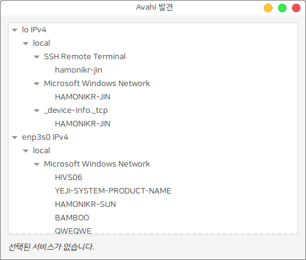
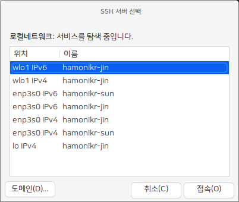

# hamonikr-avahi-service

로컬 네트워크에서 클라이언트가 IP를 모르는 경우에도 `Zero-configuration networking` 을 이용해서 
로컬 네트워크의 다른 시스템이 ssh, aft, nfs, http, vnc 등의 서비스를 탐색할 수 있도록 지원하는 패키지입니다.

일반적으로는 서버의 IP주소를 알아야 클라이언트에서 서비스를 접속할 수 있지만
이 서비스는 접속할 클라이언트가 서버의 IP를 모르는 경우에도 로컬 네트워크에 전파되고 있는 호스트명으로 서비스를 접속할 수 있습니다.
(네트워크 프린터 같은 경우, 프린터 서버의 주소를 몰라도 자동으로 설치할 수 있도록 이름을 전파하고 있습니다)

 * Zeroconf 란? : https://en.wikipedia.org/wiki/Zero-configuration_networking

이 패키지를 설치하면 기본 서비스로 `ssh`와 `aft` 서비스가 활성화 됩니다.

## 만약 다른 서비스를 설정하려면
만약 다른 서비스를 추가하고 싶은 경우에는 `/etc/avahi/services/` 경로에 서비스 파일을 생성하고 `sudo systemctl restart avahi-daemon` 명령으로 서비스를 재 시작하면 적용됩니다.

다른 서비스 파일의 형식은 아래 문서를 참고하세요.
 * https://wiki.archlinux.org/title/Avahi
 * avahi github : https://github.com/lathiat/avahi

# Usage

프로그램 > `Avahi Zeroconf Browser`를 실행하면 아래 이미지와 같은 로컬 네트워크를 탐색할 수 있는 창이 나오고, 로컬 네트워크에서 서비스를 공급하고 있는 시스템을 확인할 수 있습니다.



프로그램 > `Avahi SSH Server Browser`를 실행하면 아래 이미지와 같은 로컬 네트워크에서 SSH 서비스를 공급하고 있는 시스템을 확인할 수 있습니다. `접속`버튼을 누르면 해당 시스템으로 접속됩니다.



이 서비스는 집이나 개발용 환경에서는 쉬운 서비스 공급을 위해서 사용될 수 있지만, 실제 운영환경에서는 보안상 취약점이 될 수 있으므로 사용을 권장하지 않습니다.

# 라이선스

LGPL-2.1 License

# 설치

## HamoniKR (>= 3.0)
```
sudo apt update
sudo apt install hamonikr-avahi-service
```

## Other Ubuntu based distro
```
# add hamonikr apt repo
wget -qO- https://pkg.hamonikr.org/add-hamonikr.apt | sudo -E bash -

# install
sudo apt install hamonikr-avahi-service
```

# FAQ

1) ping <호스트명>.local 을 하면 다른 IP를 리턴하는 경우
```
dhcp 로 받은 dns 서버 정보를 사용하는 경우 
정상적인 IP를 리턴하지 못하는 경우가 있습니다. 

DNS 서버 정보를 8.8.8.8 로 변경하세요.
```

2) 로컬 네트워크의 ssh 접속이 안되는 경우

```
ssh 서비스가 구동 중인지 확인하세요.
만약 서비스가 구동되지 않으면 다음과 같이 ssh 서비스를 추가하세요.

sudo apt install openssh-server
```

3) 로컬 네트워크의 시스템을 찾지 못하는 경우

```
방화벽에서 UDP 5353 포트를 허용해주세요

sudo ufw allow 5353/udp
```